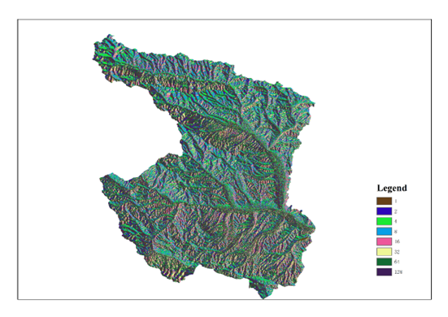
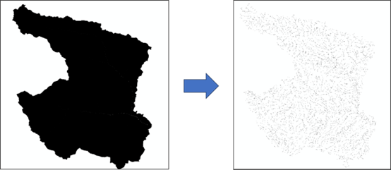
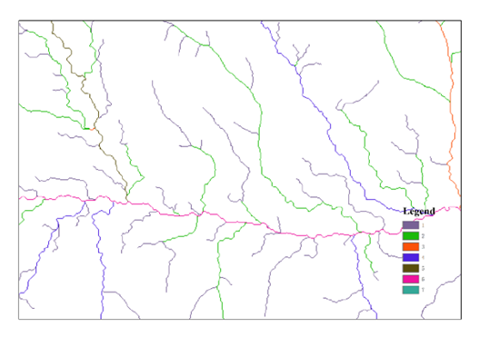
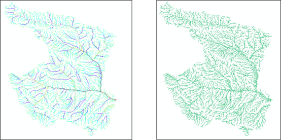

# 通过Arcpy进行河网提取

## 文件构成

### XML输入：

```xml
<WaterExtract>
    <InputDemFilePath>E:\工作内容\河网提取\GIS图层\XiNingElevation.tif</InputDemFilePath>
    <OutputFolderPath>E:\工作内容\河网提取\WaterExtract\输出文件夹</OutputFolderPath>
    <Threshold>10000</Threshold>
</WaterExtract>
```

**其中，`InputDemFilePath`是输入的DEM，`OutputFolderPath`是输出图层的存放位置，`Threshold`是汇水面积阈值。**

### 分步结果







